# Design — ORAN CFM-Lite 이상탐지
- 문서버전: v2.2 — 2025-09-30
- 업데이트: 사람 친화적 보고서, 구조화된 로그 시스템, 이식성 개선


## 1. 시스템 아키텍처

```mermaid
flowchart LR
  subgraph RU_DU[O-RU / O-DU]
    RU[장비]:::dev -->|NETCONF/YANG| MPlane[M-Plane]
  end
  MPlane --> Cap[Capability Detector]
  Cap -->|기능 매핑| Coll[Collectors]
  Coll --> Bus[(Message Bus)]
  Bus --> FE[Feature Engine\n(Sliding Window)]
  FE -->|변화점| CP[CUSUM/PELT]
  FE -->|예측-잔차| FR[TCN/LSTM (소형)]
  FE -->|옵션| MV[Group Multivariate\n(MSCRED/IF)]
  CP --> FX[Score Fusion]
  FR --> FX
  MV --> FX
  FX --> ST[(Alert Store)]
  FX --> OBS[Metrics/Logs]
  ST --> Noti[Notifier/ITSM]
  OBS --> Dash[Dashboard/KPI]
classDef dev fill:#eef,stroke:#99f;
```

## 2. Capability-Driven 파이프라인 흐름

```mermaid
sequenceDiagram
  participant RU as O-RU/O-DU
  participant CAP as Capability Detector
  participant COL as Collectors
  participant FE as Feature Engine
  participant DET as Detectors

  RU->>CAP: NETCONF hello (capabilities)
  CAP->>COL: { lbm:bool, udp_echo:bool, ecpri:bool, ccm_min:bool }
  COL->>FE: 활성 메트릭 스트림 publish
  FE->>DET: x = features(p95/p99, slope, CUSUM, residual, runlen)
  DET-->>FE: s = scores(rule, cp, residual, mv)
  FE->>FX: score fusion → severity
```



## 3. 데이터 모델(요약 ER)


## 4. 토픽/인터페이스(예시)
- `oran.caps` — endpoint_id, caps(json), ts
- `oran.metrics` — 정규화된 측정값 스트림
- `oran.features` — 윈도우 피처
- `oran.alerts` — severity, evidence(top3), caps_snapshot

## 5. 탐지 로직(의사코드)

```python
caps = get_caps(endpoint)
x = make_features(stream, caps)  # p95/p99, slope, EWMA, cusum, runlen...

s_rule = rule_score(x, caps)
s_cp   = cusum_score(x["spike_candidates"])
yhat   = tcn.predict(x["latency_window"])  # or lstm
s_res  = abs(x["latency_now"] - yhat)
s_mv   = mv_score(group_tensor) if caps.group_ok else 0.0

score = 0.35*s_rule + 0.25*s_cp + 0.30*s_res + 0.10*s_mv
sev   = bucketize(score, hysteresis=True, hold_down=120)
emit_alert(endpoint, sev, evidence=top3([s_cp,s_res,x.get("runlen"),x.get("delta_p99")]), caps=caps)
```

## 6. 배포 토폴로지
- 사이트별 경량 수집기(또는 중앙 수집) → 메시지버스(Kafka/NATS)
- 스트리밍 피처 엔진(1분 창/30초 중첩), 모델 레지스트리
- Grafana/ITSM 연동(링크 파라미터: endpoint_id, time_range)

## 7. 알람 분석 및 보고서 시스템

### 7.1 사람 친화적 보고서 생성
```
📍 기본 정보: 엔드포인트, 탐지시간, 심각도, 종합위험도
⚠️  발견된 문제: 일반인이 이해하기 쉬운 문제 요약
🔍 상세 기술 분석: 성능 지표, CUSUM 분석, 탐지 신뢰도
📊 영향도 분석: 서비스/네트워크/O-RAN 특화 영향도
💡 권장 조치사항: 실행 가능한 구체적 조치방법
👀 지속 모니터링: 관찰해야 할 핵심 지표들
```

### 7.2 구조화된 로그 시스템
```
logs/test_YYYYMMDD_HHMMSS/
├── debug/detailed.log              # 모든 디버그 정보
├── summary/summary.log             # 중요 이벤트만
└── alerts/
    ├── alert_details.log           # 기술적 알람 정보
    └── human_readable_analysis.txt # 사람 친화적 분석
```

### 7.3 환경 이식성
- **상대경로 기반**: 프로젝트 루트 기준으로 어떤 디렉토리에서든 실행
- **환경변수 지원**: `OCAD_LOG_DIR`로 로그 디렉토리 커스터마이징
- **Path 객체 호환**: 문자열/Path 객체 모두 지원

## 8. SLO/운영
- 경보 지연 p95 ≤ 30s, 알람 중복 제거율 ≥ 30%
- 주간 재학습, 월간 베이스라인 재생성(계절성)
- 튜닝 프리셋: 보수/표준/공격적
