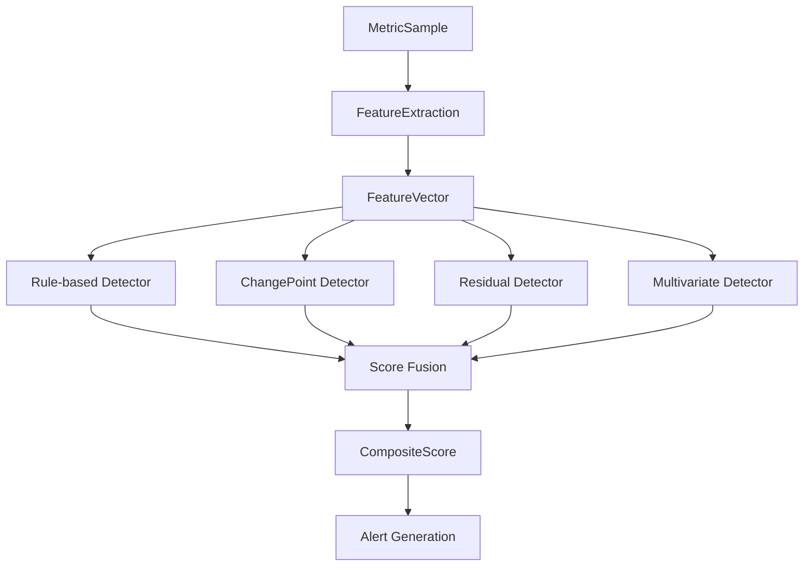

# OCAD AI 모델 가이드

## 📋 목차
1. [시스템 개요](#1-시스템-개요)
2. [룰 기반 탐지](#2-룰-기반-탐지)
3. [변화점 탐지](#3-변화점-탐지)
4. [잔차 기반 탐지](#4-잔차-기반-탐지)
5. [다변량 탐지](#5-다변량-탐지)
6. [보조 AI/ML 라이브러리](#6-보조-aiml-라이브러리)
7. [모델 통합 아키텍처](#7-모델-통합-아키텍처)
8. [성능 목표 및 특징](#8-성능-목표-및-특징)

## 1. 시스템 개요

OCAD(O-RAN CFM-Lite AI 이상탐지) 시스템은 **하이브리드 AI 접근법**을 사용하여 O-RAN 네트워크의 이상을 탐지합니다. 전통적인 룰 기반 방법과 최신 AI 모델을 조합하여 높은 정확도와 빠른 응답시간을 모두 확보합니다.

### 핵심 설계 철학
- **4가지 탐지 방법론의 앙상블**: Rule + ChangePoint + Residual + Multivariate
- **경량 AI 모델**: 실시간 처리를 위한 최적화
- **O-RAN 특화**: 제한된 CFM 신호로도 효과적 탐지
- **확장 가능한 구조**: 모듈형 설계로 모델 추가/교체 용이

---

## 2. 룰 기반 탐지

### 📁 구현 위치
```
ocad/detectors/rule_based.py
```

### 🎯 특징
- **AI 모델 아님** (전통적 임계값 기반)
- **즉시 탐지**: 실시간으로 임계값 위반 감지
- **높은 정확도**: 명확한 기준으로 오탐 최소화
- **빠른 응답**: 계산 복잡도 낮음

### 📊 탐지 기준
| 메트릭 | 임계값 | 설명 |
|--------|--------|------|
| **UDP Echo P99** | 5.0ms (기본) | UDP 응답시간 99퍼센타일 |
| **LBM RTT P99** | 5.0ms (기본) | 루프백 지연시간 99퍼센타일 |
| **eCPRI P99** | 5.0ms (기본) | eCPRI 지연시간 99퍼센타일 |
| **연속 실패** | 3회 (기본) | 연속적인 실패 횟수 |

### ⚙️ 설정
```python
class DetectionConfig:
    rule_weight: float = 0.35                    # 전체 점수에서 35% 가중치
    rule_p99_threshold_ms: float = 100.0         # P99 지연 임계값
    rule_runlength_threshold: int = 3            # 연속 실패 임계값
```

---

## 3. 변화점 탐지

### 📁 구현 위치
```
ocad/detectors/changepoint.py
```

### 🤖 사용 알고리즘

#### 3.1 CUSUM (Cumulative Sum)
- **목적**: 평균값의 급격한 변화 탐지
- **특징**: 온라인 처리, 낮은 계산 복잡도
- **적용**: UDP Echo, eCPRI, LBM RTT 시계열

```python
# CUSUM 계산 방식
cusum_value = max(0, cusum_prev + (value - baseline) - drift_threshold)
```

#### 3.2 PELT (Pruned Exact Linear Time)
- **라이브러리**: `ruptures==1.1.8`
- **목적**: 정확한 변화점 위치 식별
- **특징**: 오프라인 처리, 높은 정확도

### 📦 의존성
```python
ruptures==1.1.8      # PELT 알고리즘
statsmodels==0.14.0  # 통계적 변화점 탐지
scipy==1.11.4        # 수치 계산
```

### ⚙️ 설정
```python
class DetectionConfig:
    changepoint_weight: float = 0.25    # 전체 점수에서 25% 가중치
    cusum_threshold: float = 5.0         # CUSUM 임계값
```

---

## 4. 잔차 기반 탐지

### 📁 구현 위치
```
ocad/detectors/residual.py
```

### 🧠 사용 AI 모델

#### 4.1 TCN (Temporal Convolutional Network) ⭐ 주력 모델

**구조**:
```python
class SimpleTCN(nn.Module):
    def __init__(self, input_size=1, hidden_size=32, output_size=1):
        super().__init__()
        
        # 3층 1D 컨볼루션 네트워크
        self.conv1 = nn.Conv1d(input_size, hidden_size, kernel_size=3, padding=1)
        self.conv2 = nn.Conv1d(hidden_size, hidden_size, kernel_size=3, padding=1)
        self.conv3 = nn.Conv1d(hidden_size, output_size, kernel_size=3, padding=1)
        
        self.relu = nn.ReLU()
        self.dropout = nn.Dropout(0.1)
```

**특징**:
- **시계열 예측**: 다음 값을 예측하여 실제 값과의 잔차 계산
- **경량 설계**: 3층 구조, 32개 히든 유닛으로 실시간 처리 최적화
- **빠른 학습**: 20 에포크 빠른 훈련으로 온라인 적응
- **병렬 처리**: 컨볼루션 기반으로 RNN보다 효율적

**훈련 과정**:
```python
def _train_model(self, metric_type: str):
    # 1. 데이터 정규화 (StandardScaler)
    data_scaled = self.scalers[metric_type].fit_transform(data.reshape(-1, 1))
    
    # 2. 시퀀스 생성 (sliding window)
    for i in range(len(data_scaled) - sequence_length):
        X.append(data_scaled[i:i + sequence_length])
        y.append(data_scaled[i + sequence_length])
    
    # 3. TCN 모델 훈련
    model = SimpleTCN(input_size=1, hidden_size=16, output_size=1)
    optimizer = torch.optim.Adam(model.parameters(), lr=0.01)
    
    for epoch in range(20):  # 빠른 훈련
        outputs = model(X_tensor)
        loss = criterion(outputs.squeeze(), y_tensor)
        loss.backward()
        optimizer.step()
```

#### 4.2 LSTM (Long Short-Term Memory) - 대안 모델
- **현재 상태**: PRD에서 TCN의 대안으로 언급
- **미래 계획**: 필요 시 TCN과 교체 가능한 구조
- **장점**: 장기 의존성 학습에 우수
- **단점**: TCN 대비 느린 처리 속도

### 📦 의존성
```python
torch==2.1.1        # PyTorch 프레임워크
numpy==1.24.3       # 수치 계산
scikit-learn==1.3.2 # 전처리 (StandardScaler)
```

### 🎯 탐지 과정
1. **이력 데이터 수집**: 각 메트릭별 시계열 저장
2. **모델 훈련**: 50개 이상 샘플 수집 시 자동 훈련
3. **예측 수행**: 현재 시퀀스로 다음 값 예측
4. **잔차 계산**: |실제값 - 예측값| / 표준편차
5. **이상 점수**: 잔차가 임계값(3.0) 초과 시 이상

### ⚙️ 설정
```python
class DetectionConfig:
    residual_weight: float = 0.30        # 전체 점수에서 30% 가중치
    residual_threshold: float = 3.0      # 잔차 이상 임계값 (표준편차 배수)
```

---

## 5. 다변량 탐지

### 📁 구현 위치
```
ocad/detectors/multivariate.py
```

### 🔗 사용 AI 모델

#### 5.1 Isolation Forest ⭐ 현재 구현

**알고리즘 원리**:
```python
from sklearn.ensemble import IsolationForest

model = IsolationForest(
    contamination=0.1,      # 10% 이상 비율 예상
    random_state=42,
    n_estimators=100,       # 100개 트리 앙상블
)
```

**특징**:
- **이상 탐지 전용**: 정상 패턴에서 벗어난 데이터 포인트 식별
- **다차원 분석**: 여러 메트릭(UDP Echo, eCPRI, LBM) 간의 복합적 이상 패턴
- **무감독 학습**: 라벨 없는 데이터로 정상 패턴 학습
- **앙상블 방법**: 100개 고립 트리의 평균으로 안정성 확보

**학습 과정**:
```python
def _train_model(self, group_key: str, capabilities: Capabilities):
    # 1. 피처 추출
    for features in self.feature_history[group_key]:
        feature_array = self._extract_feature_array(features, capabilities)
        training_data.append(feature_array)
    
    # 2. 데이터 정규화
    scaler = StandardScaler()
    X_scaled = scaler.fit_transform(training_matrix)
    
    # 3. Isolation Forest 훈련
    model = IsolationForest(contamination=0.1)
    model.fit(X_scaled)
```

**피처 구성**:
- UDP Echo: P95, P99, CUSUM
- eCPRI: P95, P99, CUSUM  
- LBM: P95, P99, CUSUM, 실패율
- 추가: EWMA, 기울기, 잔차

#### 5.2 MSCRED - 고급 모델 (미래 구현)

**계획 사항** (Tasklist-4.md Sprint 4):
- **Multi-Scale Convolutional Recurrent Encoder-Decoder**
- **복잡한 시계열 패턴**: 다중 스케일 시간 의존성 학습
- **구현 단계**: Isolation Forest 효과 검증 → MSCRED 승격
- **예상 성능**: 더 복잡한 다변량 패턴 탐지 가능

```python
# 미래 구현 예정
class MSCRED(nn.Module):
    def __init__(self, feature_dim, hidden_dim):
        # Multi-scale convolution layers
        # Recurrent encoder-decoder
        # Attention mechanism
        pass
```

### 📦 의존성
```python
scikit-learn==1.3.2     # Isolation Forest
numpy==1.24.3           # 수치 계산
# 미래: tensorflow==2.14.0 (MSCRED 구현 시)
```

### ⚙️ 설정
```python
class DetectionConfig:
    multivariate_weight: float = 0.10   # 전체 점수에서 10% 가중치

class MultivariateDetector:
    min_training_samples = 50            # 최소 훈련 샘플 수
    contamination = 0.1                  # 예상 이상 비율 10%
```

---

## 6. 보조 AI/ML 라이브러리

### 6.1 준비된 고급 ML 프레임워크

```python
# 딥러닝 프레임워크
tensorflow==2.14.0  # MSCRED, 복잡한 딥러닝 모델용
torch==2.1.1        # TCN, 경량 신경망 모델용

# 그래디언트 부스팅 (향후 사용)
xgboost==2.0.1      # 구조화된 데이터 예측
lightgbm==4.1.0     # 경량 부스팅, 빠른 훈련
```

### 6.2 전처리 및 피처 엔지니어링

**통계적 피처**:
- **StandardScaler**: 데이터 정규화 (평균 0, 분산 1)
- **EWMA**: 지수가중이동평균으로 추세 분석
- **백분위수**: P95, P99로 극값 패턴 추출
- **기울기**: 시계열 변화율 측정

**시계열 피처**:
```python
# CUSUM 누적량
cusum_value = max(0, cusum_prev + (value - baseline) - drift)

# EWMA 스무딩
ewma_value = alpha * current_value + (1 - alpha) * ewma_prev

# 기울기 계산
slope = (recent_values[-1] - recent_values[0]) / len(recent_values)
```

### 6.3 시계열 분석 라이브러리

```python
ruptures==1.1.8      # 변화점 탐지 (PELT, CUSUM)
statsmodels==0.14.0  # 시계열 통계 분석
scipy==1.11.4        # 수치 최적화, 신호 처리
```

---

## 7. 모델 통합 아키텍처

### 🏗️ CompositeDetector 구조

```python
class CompositeDetector:
    def __init__(self, config):
        self.detectors = [
            RuleBasedDetector(config),      # 룰 기반
            ChangePointDetector(config),    # 변화점 (CUSUM/PELT)
            ResidualDetector(config),       # 잔차 (TCN)
            MultivariateDetector(config),   # 다변량 (Isolation Forest)
        ]
```

### 🔄 탐지 프로세스



### 📊 점수 융합 (Score Fusion)

```python
def calculate_composite_score(scores, config):
    composite_score = (
        config.rule_weight * scores["rule_score"] +           # 35%
        config.changepoint_weight * scores["changepoint_score"] +  # 25%
        config.residual_weight * scores["residual_score"] +   # 30%
        config.multivariate_weight * scores["multivariate_score"]  # 10%
    )
    return min(1.0, composite_score)  # 0-1 범위로 제한
```

### 🎯 가중치 설계 철학

| 탐지 방법 | 가중치 | 역할 | 특성 |
|-----------|--------|------|------|
| **Rule-based** | **35%** | 즉시 탐지 | 높은 정확도, 낮은 지연 |
| **Residual (TCN)** | **30%** | 조기 경고 | 예측 기반, 리드타임 확보 |
| **ChangePoint** | **25%** | 급격한 변화 | CUSUM/PELT, 변화점 식별 |
| **Multivariate** | **10%** | 복합 패턴 | 다차원 상관관계 |

---

## 8. 성능 목표 및 특징

### 📈 성능 목표 (PRD 기준)

| 메트릭 | 목표값 | 담당 모델 |
|--------|--------|-----------|
| **MTTD 단축** | 20-30% | CUSUM + TCN |
| **사전 경고 리드타임** | ≥ 4분 (P50) | TCN 잔차 예측 |
| **오경보율 (FAR)** | ≤ 6% | 앙상블 조합 |
| **운영자 승인율** | ≥ 80% | 사람 친화적 보고서 |
| **처리 지연** | ≤ 30초 (P95) | 경량 AI 모델 |
| **Capability 커버리지** | ≥ 95% | 자동 기능 탐지 |

### 🚀 핵심 특징

#### 8.1 하이브리드 접근법
- **전통적 방법 + AI**: 룰의 정확성 + AI의 학습 능력
- **상호 보완**: 각 방법의 약점을 다른 방법이 보완
- **안정성**: 단일 모델 실패 시에도 다른 모델로 커버

#### 8.2 경량 AI 설계
- **실시간 처리**: 30초 이내 탐지 목표
- **메모리 효율**: 최소 리소스로 최대 효과
- **빠른 학습**: 온라인 적응 가능

#### 8.3 O-RAN 특화 최적화
- **제한된 신호 대응**: CFM-Lite 환경에 맞춤
- **Capability 인식**: 장비별 지원 기능 자동 탐지
- **확장성**: 새로운 O-RAN 기능 쉽게 추가

#### 8.4 모듈러 아키텍처
```python
# 새 탐지 모델 쉽게 추가
class NewAIDetector(BaseDetector):
    def detect(self, features, capabilities):
        # 새로운 AI 알고리즘 구현
        return score

# CompositeDetector에 자동 통합
composite_detector.add_detector(NewAIDetector(config))
```

### 🎯 실전 적용 시나리오

#### 시나리오 1: 급격한 지연 증가
1. **Rule-based**: 임계값 초과 즉시 탐지 (0초)
2. **CUSUM**: 급격한 변화 확인 (5초)
3. **TCN**: 추세 예측으로 지속 여부 판단 (10초)
4. **Isolation Forest**: 복합 패턴으로 근본 원인 추정 (15초)

#### 시나리오 2: 점진적 성능 저하
1. **TCN**: 예측 잔차 증가로 조기 감지 (2-3분 선행)
2. **CUSUM**: 누적 변화량으로 확인
3. **Rule-based**: 임계값 도달 시 확정
4. **Multivariate**: 다른 메트릭과의 상관관계 분석

---

## 🔮 미래 로드맵

### Phase 1: 현재 구현 ✅
- Rule-based + CUSUM + TCN + Isolation Forest
- 기본 앙상블 구조 완성

### Phase 2: 고급 AI 모델 🔄
- **MSCRED 도입**: 복잡한 다변량 패턴 학습
- **GNN 실험**: 네트워크 토폴로지 기반 이상 전파
- **Transformer**: 장기 의존성 학습

### Phase 3: 자동화 🚀
- **AutoML**: 하이퍼파라미터 자동 튜닝
- **온라인 학습**: 실시간 모델 업데이트
- **A/B 테스팅**: 모델 성능 자동 비교

---

**OCAD는 전통적 방법론과 최신 AI 기술을 균형있게 조합한 하이브리드 이상탐지 시스템으로, O-RAN 환경의 특수성을 고려한 실용적 AI 솔루션입니다.** 🎯
